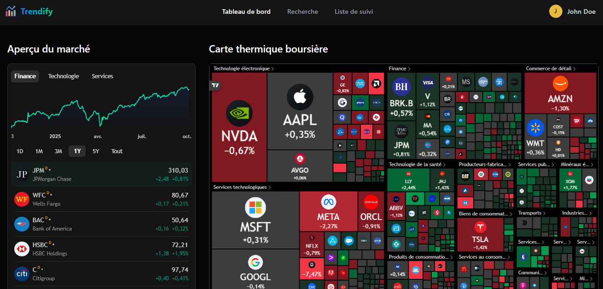

<div align="center">
  
  
  # Trendify - Plateforme d'Analyse des Marchés Financiers

  [](https://opensource.org/licenses/MIT)
  [](https://nextjs.org/)
  [](https://reactjs.org/)
  [](https://www.typescriptlang.org/)
  [](https://www.mongodb.com/)
  [](https://git-scm.com/)
  [](https://nodejs.org/)
  [](https://ui.shadcn.com/)
  [](https://finnhub.io/)
  [](https://nodemailer.com/)
  [](https://www.inngest.com/)
  [](https://www.npmjs.com/package/better-auth)
  [](https://coderabbit.ai/)
  [](https://vercel.com/)

  *Plateforme d'analyse avancée des marchés financiers et de suivi des tendances*
  *Une solution complète pour les investisseurs et les traders avec des outils puissants d'analyse technique et fondamentale*
</div>

## 🌟 Qu'est-ce que Trendify ?

Trendify est une plateforme innovante d'analyse des marchés financiers qui permet aux investisseurs et aux traders de suivre, analyser et anticiper les tendances du marché. Ma solution combine des données financières en temps réel, des outils d'analyse technique avancés et des fonctionnalités de veille concurrentielle pour vous aider à prendre des décisions d'investissement éclairées.

### 🔍 Pourquoi choisir Trendify ?
- **Données en temps réel** : Accès à des données financières mises à jour en continu
- **Analyse technique avancée** : Outils de charting puissants avec indicateurs techniques personnalisables
- **Watchlists personnalisables** : Suivez vos actifs préférés et recevez des alertes personnalisées
- **Interface utilisateur intuitive** : Conçue pour les débutants comme pour les professionnels
- **Sécurité renforcée** : Protocoles de sécurité avancés pour protéger vos données

## 🚀 Fonctionnalités Principales

### 📊 Tableau de Bord Personnalisable
- **Page de Détails des Actions** :
  - Mise en page à deux colonnes optimisée pour l'analyse
  - Données en temps réel sur les symboles suivis
  - Graphiques avancés avec indicateurs techniques personnalisables
  - Profil détaillé de l'entreprise et données financières
  - Analyse technique complète avec outils intégrés

- **Gestion des Watchlists** :
  - Bouton de suivi intelligent avec états multiples
  - Interface bilingue français/anglais
  - Retour visuel immédiat lors des ajouts/suppressions
  - Synchronisation en temps réel sur tous les appareils

- **Analyse de Marché** :
  - Vue d'ensemble des performances de votre portefeuille
  - Alertes personnalisables sur les mouvements de prix
  - Comparaison avec les indices de référence

### 🔐 Authentification et Sécurité
- **Nouvelle interface d'authentification** : Mise en page moderne à deux colonnes avec témoignages
- **Processus d'inscription avancé** :
  - Formulaire en plusieurs étapes avec validation en temps réel
  - Sélecteurs personnalisés pour le pays, l'objectif d'investissement, le profil de risque et le secteur d'activité
  - Sélecteur de pays avec recherche et affichage des drapeaux
  - États de chargement et retours utilisateur clairs
- **Sécurité renforcée** :
  - Connexion sécurisée avec gestion des sessions
  - Authentification par email/mot de passe
  - Protection des routes et contrôle d'accès granulaire

### 🖥️ Interface Utilisateur Moderne
- **Recherche intelligente** :
  - Barre de recherche accessible depuis l'en-tête et le menu utilisateur
  - Raccourci clavier Cmd/Ctrl+K pour un accès rapide
  - Résultats en temps réel avec mise en évidence
  - Suggestions de symboles populaires par défaut
  - Gestion des états de chargement et des résultats vides

- **Navigation optimisée** :
  - Barre de navigation collante avec accès rapide aux fonctionnalités clés
  - Mise en évidence des liens actifs
  - Menu utilisateur avec avatar personnalisé
  - Nouvel onglet "Recherche" dans la navigation principale

- **Expérience utilisateur** :
  - Architecture de mise en page pleine hauteur
  - Boîte de dialogue modale pour la recherche
  - Interface réactive et fluide
  - Retours visuels clairs pour chaque action
- **Design réactif** : S'adapte parfaitement à tous les appareils
- **Thèmes clair/sombre** : Pour un confort visuel optimal dans toutes les conditions lumineuses
- **Composants réutilisables** : Bibliothèque complète de composants UI cohérents
  - Sélecteurs personnalisés (pays, objectifs, risque, secteur d'activité)
  - Champs de formulaire avec validation
  - États de chargement et retours utilisateur
- **Design cohérent** :
  - En-tête mis à jour avec logo compact
  - Navigation intuitive et expérience utilisateur fluide
  - Libellés et textes en français pour une meilleure accessibilité

### 📰 Actualités et Recherche
- **Bulletins quotidiens personnalisés** :
  - Synthèse des actualités basée sur votre watchlist
  - Curation intelligente des articles les plus pertinents
  - Envoi par email à l'heure de votre choix
  
- **Moteur de recherche avancé** :
  - Recherche d'actions par symbole ou nom d'entreprise
  - Suggestions de symboles populaires
  - Résultats en temps réel avec mise en évidence des correspondances
  
- **Veille marché intelligente** :
  - Actualités triées par pertinence pour votre portefeuille
  - Alertes sur les mouvements importants
  - Filtrage par secteur et région

### 🗃️ Gestion des Données
- **Base de données MongoDB** :
  - Connexion persistante pour des performances optimales
  - Reconnexion automatique en cas de déconnexion
  - Gestion efficace du cache pour une expérience utilisateur fluide
  - Scripts utilitaires pour le débogage et la maintenance
  - Vérification de la connectivité via l'interface en ligne de commande
  - Gestion centralisée des erreurs et des timeouts

## 🛠️ Stack Technique

### Frontend
- **Framework** : Next.js 15.5.4 avec App Router
- **Langage** : TypeScript 5.3.3
- **Styling** : 
  - Tailwind CSS avec classes utilitaires
  - class-variance-authority pour les variantes de composants
  - tailwind-merge pour la fusion des classes
- **UI Components** : 
  - shadcn/ui (basé sur Radix UI Primitives)
  - Composants personnalisés accessibles
- **Gestion d'État** : 
  - React Hooks (useState, useEffect, useMemo, useCallback)
  - React Context API
- **Formulaires** : 
  - React Hook Form pour la gestion des états et la validation
- **UI/UX** :
  - Lucide React pour les icônes
  - Sonner pour les notifications toast
  - use-debounce pour optimiser les recherches
- **Routing** : Next.js App Router avec layouts imbriqués
- **Données** :
  - SWR pour la récupération de données
  - Optimistic updates pour une meilleure réactivité
- **Outils de développement** :
  - ESLint pour le linting
  - Prettier pour le formatage du code

### Backend
- **Base de données** :
  - MongoDB avec Mongoose ODM
  - Gestion des connexions optimisées
- **Authentification** :
  - Better-auth avec adaptateur MongoDB
  - Gestion des sessions sécurisées
  - Cookies HTTP-only
- **API** :
  - Routes API Next.js
  - Gestion des erreurs centralisée
  - Validation des entrées
- **Tâches asynchrones** :
  - Inngest pour le traitement en arrière-plan
  - Gestion des files d'attente de tâches
- **Emails** :
  - Nodemailer avec template HTML
  - Emails transactionnels et notifications
- **Données externes** :
  - Intégration avec Finnhub API pour les données boursières
  - Mise en cache des données pour de meilleures performances

## 🚀 Mise en Route

### Prérequis
- Node.js 20+
- MongoDB (local ou Atlas)
- Compte Gmail avec accès aux applications moins sécurisées activé (pour les emails)
- Clé API Finnhub (pour les données boursières)

### Installation

1. **Cloner le dépôt**
   ```bash
   git clone https://github.com/KemogneAlex/trendify.git
   cd trendify
   ```

2. **Installer les dépendances**
   ```bash
   npm install
   # ou
   yarn install
   ```

3. **Configuration de l'environnement**
   Créez un fichier `.env.local` à la racine du projet et ajoutez les variables d'environnement suivantes :
   ```env
   # Environnement
   NODE_ENV=development
   NEXT_PUBLIC_BASE_URL=http://localhost:3000
   
   # Base de données
   MONGODB_URL="votre-chaîne-de-connexion-mongodb"
   
   # Authentification
   BETTER_AUTH_SECRET=votre_secret_tres_long_et_securise
   BETTER_AUTH_URL=http://localhost:3000
   
   # Email
   NODEMAILER_EMAIL=votre-email@gmail.com
   NODEMAILER_PASSWORD=votre-mot-de-passe-application
   
   # API Externe - Finnhub
   NEXT_PUBLIC_FINNHUB_API_KEY=votre-cle-api-finnhub
   
   # Inngest
   INNGEST_SIGNING_KEY=votre-cle-de-signature-inngest
   INNGEST_EVENT_KEY=votre-cle-evenement-inngest
   
   # Gemini (si utilisé)
   # GEMINI_API_KEY=votre-cle-api-gemini
   FINNHUB_API_KEY=votre-cle-api-finnhub
   ```

4. **Lancer l'application en mode développement**
   ```bash
   # Dans un premier terminal, lancez Next.js
   npm run dev
   # ou
   yarn dev
   ```

   ```bash
   # Dans un second terminal, lancez Inngest en mode développement
   npx inngest-cli@latest dev
   ```

5. **Accéder à l'application**
   - Application principale : [http://localhost:3000](http://localhost:3000)
   - Dashboard Inngest : [http://localhost:8288](http://localhost:8288) (disponible après avoir lancé `npx inngest-cli@latest dev`)

## 🏗️ Structure du Projet

```
trendify/
├── app/                    # Dossier principal de l'application
│   ├── api/               # Routes API
│   ├── (auth)/            # Pages d'authentification
│   ├── (root)/            # Pages principales
│   └── dashboard/         # Tableau de bord utilisateur
├── components/            # Composants réutilisables
│   ├── ui/                # Composants UI de base
│   └── shared/            # Composants partagés
├── lib/                   # Utilitaires et configurations
│   ├── actions/           # Actions serveur
│   ├── better-auth/       # Configuration d'authentification
│   ├── inngest/           # Tâches en arrière-plan
│   └── nodemailer/        # Configuration des emails
├── public/                # Fichiers statiques
│   └── assets/            # Images et autres ressources
└── types/                 # Définitions de types TypeScript
```

## 📜 Scripts utiles

### Initialisation du projet
```bash
# Création du projet Next.js
npx create-next-app@latest

# Initialisation de shadcn/ui
npx shadcn@latest init
```

### Développement
```bash
# Ajout de composants shadcn
npx shadcn@latest add dropdown-menu
npx shadcn@latest add avatar
npx shadcn@latest add popover
npx shadcn@latest add command
npx shadcn@latest add sonner

# Installation des dépendances
npm i react-hook-form
npm i react-select-country-list --save
npm i --save-dev @types/react-select-country-list
```

### Base de données
```bash
# Installation de MongoDB et Mongoose
npm i mongodb mongoose
npm install dotenv

# Tester la connexion à la base de données
npm run test:db
```

### Authentification et Emails
```bash
# Installation de l'authentification
npm i better-auth

# Configuration des emails
npm i nodemailer
npm install --save-dev @types/nodemailer
```

### Déploiement
```bash
# Installation de Vercel CLI
npm install -g vercel
vercel login
vercel --prod

# Lancer Inngest en mode développement
npx inngest-cli@latest dev
```

### Gestion des branches Git
```bash
# Création et gestion des branches
git checkout -b header
git checkout -b homepage
git checkout main
git pull
git checkout -b auth-ui
git push --set-upstream origin auth-ui
```

## 🔗 Liens utiles

### Développement
- [Next.js](https://nextjs.org/) - Le framework React pour le rendu côté serveur
- [shadcn/ui](https://ui.shadcn.com/docs/installation/next) - Composants UI accessibles et personnalisables
- [React Hook Form](https://react-hook-form.com/) - Gestion des formulaires React
- [React Select Country List](https://www.npmjs.com/package/react-select-country-list) - Sélecteur de pays pour React

### Données et API
- [Finnhub](https://finnhub.io/) - API de données financières en temps réel
- [TradingView](https://fr.tradingview.com/) - Outils de charting et d'analyse technique
  - [Documentation des widgets](https://www.tradingview.com/widget-docs/widgets/)
  - [Advanced Chart Widget](https://www.tradingview.com/widget-docs/widgets/charts/advanced-chart/)

### Backend et Infrastructure
- [MongoDB Atlas](https://cloud.mongodb.com/) - Base de données NoSQL dans le cloud
- [Inngest](https://www.inngest.com/) - Orquestration de workflows backend
- [Nodemailer](https://nodemailer.com/) - Envoi d'emails avec Node.js
- [Better Auth](https://www.better-auth.com/) - Solution d'authentification

### Outils et Intégration Continue
- [Coderabbit](https://www.coderabbit.ai/) - Revue de code par IA


## 📄 Licence

Ce projet est sous licence MIT.

## 📞 Support

Pour toute question ou assistance, veuillez me contacter à [kemognemalone@gmail.com](mailto:kemognemalone@gmail.com).

---

<div align="center">
  <p>Développé avec ❤️ par Kemogne Alex</p>
  <p>© 2025 Trendify - Tous droits réservés</p>
</div>
